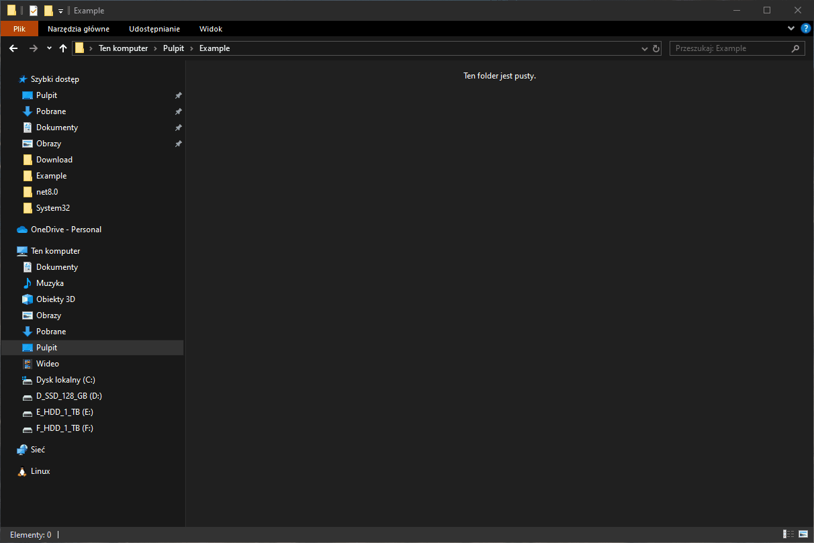
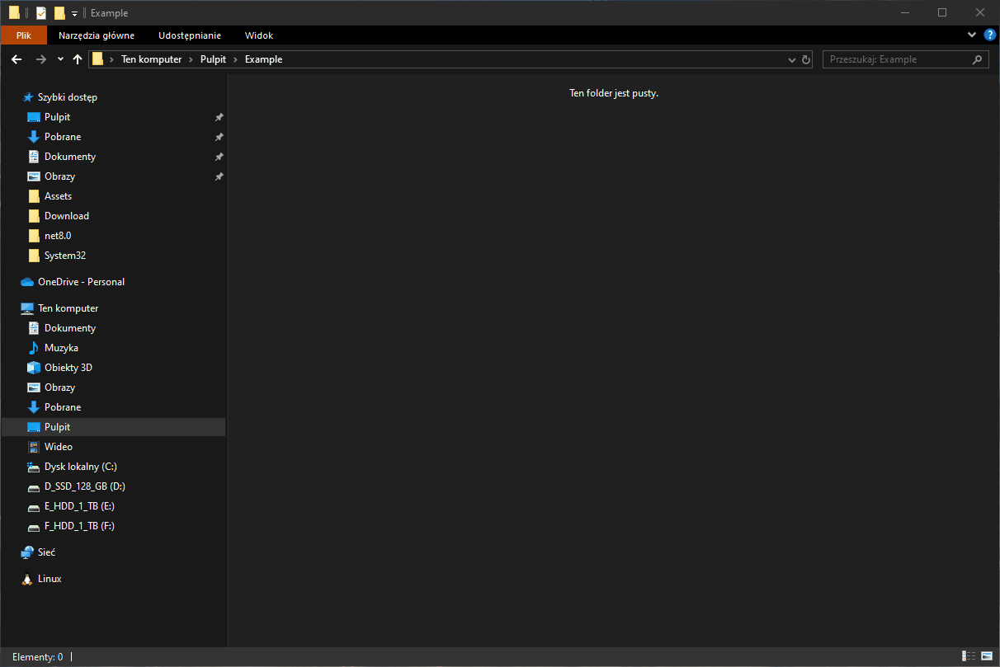
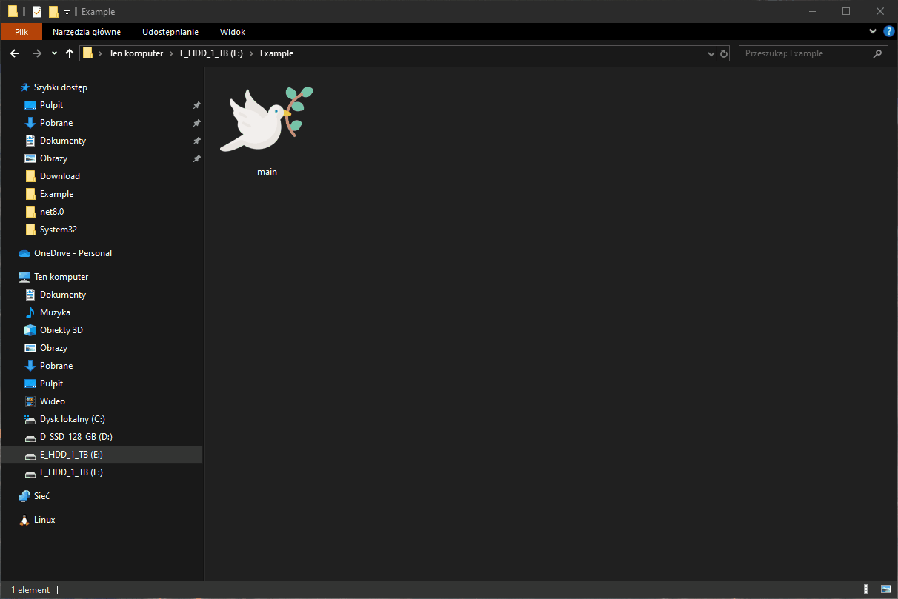
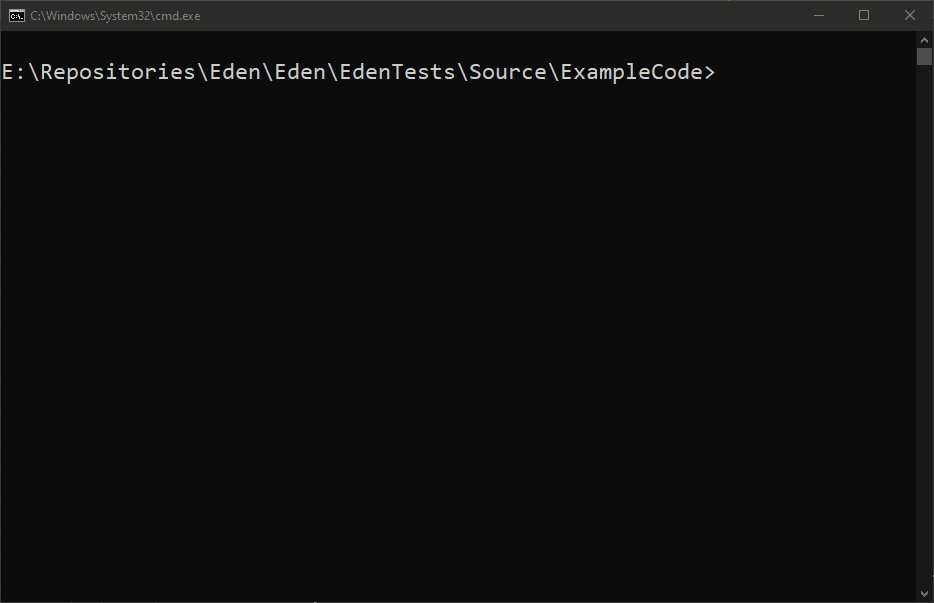

# Eden - programing language


`Eden` is an `interpreted` programming language with a built-in REPL and an interpreter for files with the `.eden` extension. It is built entirely from scratch without relying on grammar generators like Bison or tokenizers like Lex. This deliberate choice was made to deepen the understanding of language construction and parsing techniques.

The interpreter is written in `C#` and based on the `.NET` platform, chosen for its robust cross-platform capabilities, enabling easy migration across `Windows`, `macOS`, and `Linux`. Additionally, `C#` offers extensive tools for software testing, ensuring reliability and maintainability throughout development.

Performance optimization was never a primary concern for `Eden`, as the focus is on clarity, learning, and design flexibility. The language employs an `LL(1)` parser, a top-down approach that predicts the next token, making parsing more structured. The implementation uses `Pratt parsing`, which allows efficient expression evaluation while maintaining a simple and extensible syntax.

The parser generates an `Abstract Syntax Tree (AST)`, which serves as the foundation for evaluation. Eden’s evaluator follows a `tree-walking` approach, traversing the AST and executing expressions accordingly. At this stage, no AST optimization has been implemented, but future improvements may include enhancements to parsing efficiency and execution performance.

---

<h1 id="custom-sections" style="color: rgb(117, 198, 166);">Sections</h1>

- <a href="#custom-motivation" style="font-size: 1.2em; color: rgb(117, 198, 166);">**Motivation**</a>  
- <a href="#custom-resources" style="font-size: 1.2em; color: rgb(117, 198, 166);">**Resources**</a>  
- <a href="#custom-milestones" style="font-size: 1.2em; color: rgb(117, 198, 166);">**Milestones**</a>  
- <a href="#custom-instalation" style="font-size: 1.2em; color: rgb(117, 198, 166);">**Instalation**</a>
- <a href="#custom-interaction-with-language" style="font-size: 1.2em; color: rgb(117, 198, 166);">**Interaction with Language**</a>  
- <a href="#custom-examples" style="font-size: 1.2em; color: rgb(117, 198, 166);">**Examples**</a>  
- <a href="#custom-console-output-example" style="font-size: 1.2em; color: rgb(117, 198, 166);">**Donut example**</a>  
- <a href="#custom-currently-implemented" style="font-size: 1.2em; color: rgb(117, 198, 166);">**Currently Implemented**</a>  
- <a href="#custom-what-the-language-journey-looks-like" style="font-size: 1.2em; color: rgb(117, 198, 166);">**What the Language Journey Looks Like**</a>  
- <a href="#custom-division-of-code" style="font-size: 1.2em; color: rgb(117, 198, 166);">**Division of Code**</a>  

---

## [⬅️ Sections](#custom-sections)
<h1 id="custom-motivation" style="color: rgb(117, 198, 166);">Motivation</h1>

`Eden` is a programming language that I created to deepen my understanding of how programming languages work, especially from a practical perspective. The theory I studied during my university years played a key role in this, and completing my specialization in `Computer Programming` would feel like a complete failure if I couldn’t even write a simple interpreter. his project was a way to apply the knowledge I gained during my studies and put into practice the concepts I had learned.

The name `"Eden"` comes from the Garden of Eden mentioned in the Bible, and it was intended to symbolize how enjoyable (at least, that’s what I hoped for) coding in this language could be. I wanted to create something as simple and pleasant to use as the `C` language, while also allowing for a higher level of abstraction through interpretative capabilities across various environments. 

When creating `Eden`, my main goal was to make everything as explicit as possible in order to understand it better. I wanted to make sure every part of the language, from the parser to the evaluator, was transparent and easy to follow. By doing so, I could learn more deeply about the inner workings of programming languages. This approach is why I was particularly guided by this quote:
> ***"An idiot admires complexity, a genius admires simplicity."***  
>  _— Terry A. Davis_  

I believe simplicity allows for clarity, and by keeping things straightforward, I could not only make the language easier to understand for others, but also deepen my own understanding of language design.

---

## [⬅️ Sections](#custom-sections)
<h1 id="custom-resources" style="color: rgb(117, 198, 166);">Resources</h1>

- **[Top Down Operator Precedence](https://tdop.github.io/)** by Vaughan R. Pratt  
- **[Writing an Interpreter in Go](https://interpreterbook.com/)** by Thorsten Ball  
- **[Let’s Build a Compiler!](http://compilers.iecc.com/crenshaw/)** by Jack W. Crenshaw  
- **[Top Down Operator Precedence](http://javascript.crockford.com/tdop/tdop.html)** by Douglas Crockford  
- **[Pratt Parsers: Expression Parsing Made Easy](http://journal.stuffwithstuff.com/2011/03/19/pratt-parsers-expression-parsing-made-easy/)** by Bob Nystrom  
- **[Programming Languages: Application and Interpretation](http://papl.cs.brown.edu/2015/)** by Shriram Krishnamurthi and Joe Gibbs Politz  
- **[How to Write a Pratt Parser | Writing a Custom Language Parser in Golang ](https://www.youtube.com/watch?v=1BanGrbOcjs&ab_channel=tylerlaceby)**  by Tyler Laceby
- **[Simple but Powerful Pratt Parsing](https://matklad.github.io/2020/04/13/simple-but-powerful-pratt-parsing.html)** by Alex Kladov

---

## [⬅️ Sections](#custom-sections)
<h1 id="custom-milestones" style="color: rgb(117, 198, 166);">Milestones</h1>

-  **Release 1.0.0**
    - Basic implementation of the language.
    - Windows installer for the interpreter.
    - Formal grammar definition for the language. When creating the parser, I didn't use grammar generators but wrote the grammar manually. The grammar definition would also help in creating syntax highlighting add-ons for development environments like VSCode.

- **Release 1.1.0**
    - Importing external files and evaluating them.
    - External libraries support.
    - Accepting input arguments.

---

## [⬅️ Sections](#custom-sections)
<h1 id="custom-instalation" style="color: rgb(117, 198, 166);">Instalation</h1>
Although `Eden` supports platforms such as `macOS` and `Linux`, the main development currently takes place on `Windows`. Because of this, a Windows installer is available for download and installation. After launching the `.msi` installer, it will handle everything and complete the setup automatically.


---

## [⬅️ Sections](#custom-sections)
<h1 id="custom-interaction-with-language" style="color: rgb(117, 198, 166);">Interaction with interpreter</h1>

This section demonstrates how the Eden language interacts with the user, showcasing various features and functionalities. The examples below show how you can use Eden interactively through a REPL or script execution.

<table>
    <tr>
      <h2>Run Eden</h2>
      
    </tr>
    <tr>
      <h2>Create new Eden script</h2>
      
    </tr>
    <tr>
      <h2>Open new script</h2>
      
    </tr>
    <tr>
      <h2>Run Eden script</h2>
      
    </tr>
    <tr>
      <h2>Run Eden REPL</h2>
      
    </tr>
</table>

---

## [⬅️ Sections](#custom-sections)
<h1 id="custom-examples" style="color: rgb(117, 198, 166);">Examples</h1>

This section contains example programs written in the `Eden` language. Some of the function implementations may seem suboptimal, but this is because not all intended functionalities of the language have been fully implemented yet, and we must work with what is available.

```vb
// Fibonacci n-th number.
Function Int Fibonacci(Var Int index){
    Var Int A = 0i;
    Var Int B = 1i;
    Var Int tmp = A + B;
    
    Loop(Var Int i = 1i; i < index; i = i + 1i){
        tmp = A + B;
        A = B;
        B = tmp;
    };
    
    Return B;
};

Var Int fibonacciNumber = Fibonacci(10i);
PrintLine(fibonacciNumber);
```

``` vb
// Is word a palindrome.
Function Bool IsPalindrome(Var String input){

    Function String Reverse(Var String input){
        Var Int length = Length(input);
        Var String reversed = "";

        Loop(Var Int i = length - 1i; i >= 0i; i = i - 1i){
            reversed = reversed + input[i];
        };

        Return reversed;
    };

    Var String reversed = Reverse(input);
    Var Int length = Length(input);

    Loop(Var Int i = 0i; i < length; i = i + 1i){
        If(input[i] != reversed[i]){
            Return False;
        };
    };
    
    Return True;
};

Var Bool isPali = IsPalindrome("abracadabra"); 
PrintLine(isPali);
```

``` vb
// Is Number Prime?
Function Bool IsPrime(Var Int n){
    If(n <= 1i){
        Return False;
    };

    If(n <= 3i){
        Return True;
    };

    If(n % 2i == 0i || n % 3i == 0i){
        Return False;
    };

    Loop(Var Int i = 5i; i * i <= n; i = i + 6i){
        If(n % i == 0i || n % (i + 2i) == 0i){
            Return False;
        };
    };

    Return True;
};

Var Bool isPrime = IsPrime(5i);
PrintLine(isPrime);
```

---

## [⬅️ Sections](#custom-sections)
<h1 id="custom-console-output-example" style="color: rgb(117, 198, 166);">Donut example</h1>

To demonstrate how `Eden` handles the console and to showcase its capabilities, a simple program was created that displays a rotating donut. This example tests several core features of the language, including loops, mathematical operations, string manipulation, and floating-point arithmetic.

Note: The video has been sped up, as the actual execution is quite time-consuming. This is due to the lack of any implemented optimizations. Currently, generating a single frame with the specified parameters takes approximately 6–8 seconds on Eden. Performance improvements will be addressed in future development, but for now, the focus is on producing working examples.

### Output


### Code
```vb
Literal 3.14f As #PI;
Literal 0.07f As #ThetaStep;
Literal 0.02f As #PhiStep;

Literal 30i As #WIDTH;
Literal 15i As #HEIGHT;
Literal #WIDTH * #HEIGHT As #SIZE;

Var Float A = 0.00f;
Var Float B = 0.00f;

List Char buffer = (#SIZE);
List Float zbuffer = (#SIZE);
Var String asciSymbols = ".,-~:;=!*#$@";

Var Int Ro = 3i;
Var Int Roo = 1i;
Var Int Ko = 4i;
Var Int Koo = #WIDTH * Ko * 3i / (8i * (Ro + Roo));

Function Int FillBuffer(Var Char symbol){
    Loop(Var Int i = 0i; i < #SIZE; i = i + 1i){
        buffer[i] = symbol;
    };
};

Function Int FillZBuffer(Var Float digit){
    Loop(Var Int i = 0i; i < #SIZE; i = i + 1i){
        zbuffer[i] = digit;
    };
};

Function Int ClearZBuffer(){
    FillZBuffer(0.0f);
};

Function Int ClearBuffer(){
    FillBuffer(' ');
};

Function Int ClearBuffers(){
    ClearBuffer();
    ClearZBuffer();
};

Function Int PrintBuffer(){
    ConsoleGoHome();
    
    Var String tmp = "";
    
    Loop (Var Int i = 0i; i < #SIZE; i = i + 1i) {
        If (i != 0i && i % #WIDTH == 0i) {
            PrintLine(tmp);
            tmp = "";
        };
        
        tmp = tmp + buffer[i];
    };
    
    If (tmp != "") {
        PrintLine(tmp);
    };
};

ConsoleClear();
Sisyphus{
    Var Float cosA = CosinusR(A);
    Var Float sinA = SinusR(A);
    Var Float cosB = CosinusR(B);
    Var Float sinB = SinusR(B);  

    ClearBuffers();

    Loop(Var Float theta = 0f; theta < 2i * #PI; theta = theta + #ThetaStep){
        Var Float cosTheta = CosinusR(theta);
        Var Float sinTheta = SinusR(theta); 

        Loop(Var Float phi = 0f; phi < 2i * #PI; phi = phi + #PhiStep){
            Var Float cosPhi = CosinusR(phi);
            Var Float sinPhi = SinusR(phi);   

            Var Float circleX = Ro + Roo * cosTheta;
            Var Float circleY = Roo * sinTheta;        

            Var Float x = circleX * (cosB * cosPhi + sinA * sinB * sinPhi) - circleY * cosA * sinB;
            Var Float y = circleX * (sinB * cosPhi - sinA * cosB * sinPhi) + circleY * cosA * cosB;
            Var Float z = 5i + cosA * circleX * sinPhi + circleY * sinA;
            Var Float ooz = 1i / z;

            Var Int xp = (#WIDTH / 2i + Koo * ooz * x);
            Var Int yp = (#HEIGHT / 2i - Koo / 2i * ooz * y);

            Var Int idx = xp + yp * #WIDTH;
            Var Float luminance = cosPhi * cosTheta * sinB - cosA * cosTheta * sinPhi - sinA * sinTheta + cosB * (cosA * sinTheta - cosTheta * sinA * sinPhi);
        
            If (idx >= 0i && idx < #SIZE && ooz > zbuffer[idx])
            {
                zbuffer[idx] = ooz;
                Var Int lumIdx = luminance * 8i;
                
                If (lumIdx < 0i){
                    lumIdx = 0i;
                }
                Else{
                    If (lumIdx > 11i){
                        lumIdx = 11i;
                    };
                };
                
                buffer[idx] = asciSymbols[lumIdx];
            };
        };
    };
    
    ConsoleGoHome();
    PrintBuffer();
    A = A + 0.04f;
    B = B + 0.08f;
};
```
### Resources:
- [**Donut Math**](https://www.a1k0n.net/2011/07/20/donut-math.html) by Aik0n
- [**3D Donut in C**](https://github.com/akhileshthite/3d-donut) by akhileshthite 
- [**Video: How to Create a Spinning Donut**](https://www.youtube.com/watch?v=LqQ-ezbyiW4&ab_channel=GiovanniCode) by GiovanniCode
- [**Video: Spinning Donut in Console**](https://www.youtube.com/watch?v=DEqXNfs_HhY&ab_channel=LexFridman) by Lex Fridman
- [**Video: 3D Donut Console Project**](https://www.youtube.com/watch?v=74FJ8TTMM5E&ab_channel=GreenCode) by GreenCode

---

## [⬅️ Sections](#custom-sections)
<h1 id="custom-currently-implemented" style="color: rgb(117, 198, 166);">What is currently implemented</h1>

### Data Types:
- `Char`
- `Int`
- `Float`
- `String`
- `List of (Char, Int, Float, String)`
### Features Implemented:
- Variable definition
- Logical and arithmetic operators
- Basic methods for displaying output on the screen
- Function definition and invocation
- Built-in functions
- Loops
- Conditional statements
- Block-scoped variables (variables defined within the execution block)

---

## [⬅️ Sections](#custom-sections)
<h1 id="custom-what-the-language-journey-looks-like" style="color: rgb(117, 198, 166);">The Language's Journey (Milestones)</h1>

- Create a `Visual Studio Code` extension that sets up a development environment, with the primary goal of enabling syntax highlighting.
- Implement the `If-Else` statement, as currently only the `If` statement with `{}` is implemented.
- Add a `None` type (similar to the `void` type in C++).
- Support for user-defined types (custom types).
- Basic standard libraries (functions like `sleep`, etc.).
- Significant improvements to semantic analysis.
- Abstract Syntax Tree (AST) optimizer.
- Generation of bytecode.
- Support for accepting external arguments from the program.
- Implement external file imports for the Eden language.

---

## [⬅️ Sections](#custom-sections)
<h1 id="custom-division-of-code" style="color: rgb(117, 198, 166);">Crutial classes description</h1>

- **Lexer**: or `lexical analyzer` processes the raw source code and converts it into `tokens`. Each token contains detailed information about its type (e.g., `identifier`, `operator`, `keyword`) and its position within the input file. This step is essential for breaking down the code into manageable pieces that can be further analyzed and processed by the parser.

- **Parser**: takes the tokens generated by the `lexer` and uses them to build the `Abstract Syntax Tree`. AST is a hierarchical structure representing the program's syntax. The tree is divided into expressions (which produce values) and statements (which perform actions but do not return values). Statements end with a semicolon (`;`), marking the completion of their execution. Parser makes sure that the syntax is valid and that the program follows the correct structure.

- **Evaluator**: traverses the AST and evaluates each statement or expression, based on the logic of the language. Through a technique called `tree-walking`, the evaluator computes the values produced by expressions and executes the side effects of statements (like assignments or function calls). The evaluator provides the final outcome or result of the program execution.

- **Environment**: manages the scope of variables and functions within the program. Each block of code (such as loops, functions, and conditionals) has its own isolated scope. This ensures that variables defined within a block do not interfere with other blocks. The environment is key for managing variable lookups and ensuring that the program can execute in an organized manner with proper access to variables and functions.

- **BuildIn**: This refers to a set of core, built-in functions and methods provided by the language. These functions are available by default without the need for the programmer to define them. Examples include functions or methods like `Print()` or `Length()`.

- **Runtime**: is the heart of the language's execution environment. It ties together all the components, including the `lexer`, `parser`, `evaluator`, `environment`, and `built-in` functions. The runtime allows the language to be executed in a structured way.

- **ReplRunner**: allows for interactive execution of `Eden` directly from the console. It enables users to write and evaluate expressions in real-time within a loop, providing immediate feedback.

- **ScriptRunner**: is responsible for executing `Eden` script files. It reads and processes `.eden` files, running them as standalone programs. The ScriptRunner comes with built-in configuration that makes it easy to execute scripts in a predefined environment, handling file input/output, error reporting, and more.