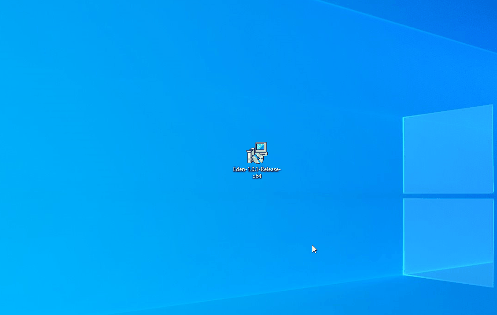

# Eden - interpreted programing language


`Eden` is an interpreted programming language `built entirely from scratch` — without grammar generators like Bison or tokenizers like Lex. This deliberate choice was made to gain a deeper understanding of `interpreter design` and `parsing techniques`. My goal was to keep every part of the language: parser, evaluator, and all supporting components — transparent and easy to follow. I believe that simplicity fosters clarity: by avoiding unnecessary complexity, I could make `Eden` easier for others to study while also strengthening my own knowledge of language design.

The idea for `Eden` grew out of my studies in `Informatics` at university, where I explored the theory behind programming languages and interpreters. This project became my way of applying that theory in practice, transforming concepts from lectures into a fully functioning language.

`Eden’s` interpreter is written in `C#` on `.NET 8`, chosen for its excellent `testing capabilities` and `cross-platform support` — allowing `Eden` to run on `Windows`, `macOS`, and `Linux`.

Performance optimization was never the main priority; the focus has always been on clarity, learning, and design flexibility. `Eden` uses a custom `LL(1)` parser, combined with `Pratt parsing` for expression evaluation — critical for handling operator precedence.

The parser produces an `Abstract Syntax Tree`, which the evaluator executes using a `tree-walking approach`. At this stage, no AST optimizations are in place; however, future versions may include improvements to both parsing efficiency and execution speed.

<br>

<h1 id="custom-sections">📖 Table Of Contents</h1>

- <a href="#custom-interaction-with-language" style="font-size: 1.2em;">**Interact with Eden**</a>  
- <a href="#custom-examples" style="font-size: 1.2em;">**Example - plain code**</a>  
- <a href="#custom-console-output-example" style="font-size: 1.2em;">**Example - Spinning Donut**</a>  
- <a href="#custom-currently-implemented" style="font-size: 1.2em;">**Language features**</a>
- <a href="#custom-how-to-write" style="font-size: 1.2em;">**Write program with Eden?**</a>    
- <a href="#custom-instalation" style="font-size: 1.2em;">**Instalation**</a>
- <a href="#custom-resources" style="font-size: 1.2em;">**Resources**</a>  

<br>

## [⬅️ Table Of Contents](#custom-sections)
<h1 id="custom-interaction-with-language">💡 Interact with Eden</h1>

`Eden` is designed to be simple and intuitive — just like `Python`. You can interact with it in multiple ways: through a `REPL`, running scripts via the `command line`, or using the `Visual Studio Code` extension.

Let’s take a closer look at each method:

<table>
    <tr>
        <h2>▶️ REPL - Read-Eval-Print Loop</h2>
        <p>You can launch Eden in REPL (Read-Eval-Print Loop) mode, which opens an interactive console. This is ideal for evaluating expressions or experimenting with code—just like Python!</P>
        
    </tr>
    <tr>
        <h2>💻 Visual Studio Code</h2>
        <p>For a more complete development experience, Eden includes a custom Visual Studio Code extension. It provides syntax highlighting, and you can run .eden files directly from within the editor.</p>
        
    </tr>
    <tr>
        <h2>🖥️ Command Line</h2>
        <p>You can write .eden files and execute them using the command line. This is great for running full scripts or automating tasks.</p>
        
    </tr>
    <tr>
        <h2>📄 Create Eden Scripts</h2>
        <p>Eden also supports easy creation of new scripts.</p>
        
    </tr>
</table>

<br>

## [⬅️ Table Of Contents](#custom-sections)
<h1 id="custom-examples">💻 Examples - plain code</h1>

This section showcases example programs written in the `Eden` language. Some implementations may appear suboptimal due to the fact that `Eden` is still under development, and not all intended features have been fully implemented yet. These examples demonstrate what can be achieved with the current functionality.

### Fibonacci n-th number
```vb
// Fibonacci n-th number.
Function Int Fibonacci(Var Int index){
    Var Int A = 0i;
    Var Int B = 1i;
    Var Int tmp = A + B;
    
    Loop(Var Int i = 1i; i < index; i = i + 1i){
        tmp = A + B;
        A = B;
        B = tmp;
    };
    
    Return B;
};

Var Int fibonacciNumber = Fibonacci(10i);
PrintLine(fibonacciNumber);
```

### Is word a palindrome?
``` vb
Var String input = "abracadabra";

// Is word a palindrome.
Function Bool IsPalindrome(Var String input){

    Function String Reverse(Var String input){
        Var Int length = Length(input);
        Var String reversed = "";

        Loop(Var Int i = length - 1i; i >= 0i; i = i - 1i){
            reversed = reversed + input[i];
        };

        Return reversed;
    };

    Var String reversed = Reverse(input);
    Var Int length = Length(input);

    Loop(Var Int i = 0i; i < length; i = i + 1i){
        If(input[i] != reversed[i]){
            Return False;
        };
    };
    
    Return True;
};

Var Bool isPali = IsPalindrome(input); 

If(isPali == True){
    PrintLine("Result: " + input + " is a palindrome!");
}
Else{
    PrintLine("Result: " + input + " is NOT a palindrome!");
};
```

### Is number a prime?
``` vb
Var Int number = 5i;

// Is Number Prime?
Function Bool IsPrime(Var Int n){
    If(n <= 1i){
        Return False;
    };

    If(n <= 3i){
        Return True;
    };

    If(n % 2i == 0i || n % 3i == 0i){
        Return False;
    };

    Loop(Var Int i = 5i; i * i <= n; i = i + 6i){
        If(n % i == 0i || n % (i + 2i) == 0i){
            Return False;
        };
    };

    Return True;
};

Var Bool isPrime = IsPrime(number);

If(isPrime == True){
    PrintLine("Result: " + number + " is prime!");
}
Else{
    PrintLine("Result: " + number + " is NOT prime!");
};
```

<br>

## [⬅️ Table Of Contents](#custom-sections)
<h1 id="custom-console-output-example">🍩 Example - Spinning Donut</h1>

To demonstrate how `Eden` interacts with the console and to showcase its core capabilities, a simple program was created that renders a rotating donut. This example exercises several key language features, including `loops`, `mathematical operations`, `string manipulation`, and `floating-point arithmetic`.

> 👉 `Hint`: You can explore the full Spinning Donut implementation in Eden in this [Github repository](https://github.com/EdenLanguage/SpinningDonut)!


> ⚠️ `Note`: The video demonstration has been sped up. Actual execution is relatively slow — each frame takes approximately 6–8 seconds to generate. This is due to the absence of optimizations in the current version of Eden. Performance enhancements are planned for future development; for now, the focus remains on functional, demonstrative examples.

<br>

## [⬅️ Table Of Contents](#custom-sections)
<h1 id="custom-currently-implemented">📌 Language features</h1>

`Eden` is still in early development, and while performance optimizations are not the focus right now, core functionality is already in place. Optimizing would take considerable time that's better spent building out the language's core features first.

Despite this, `Eden` is fully capable of running simple computational programs — in fact, the [Spinning Donut]() demo was built entirely using `Eden`!

### 🧬 Built-in Data Types
- `Char`
- `Int`
- `Float`
- `String`
- `List` of `Char`, `Int`, `Float`, or `String`

### ⚙️ Core Features
- Variable definitions
- Logical and arithmetic operators
- Basic output methods (e.g., printing to the screen)
- Function definitions and function calls
- Built-in functions
- Loops (iteration)
- Conditional statements
- Block-scoped variables (variables limited to their execution block)

> ❗ `Info`: All of this information is located in [documentation](https://github.com/EdenLanguage/Eden-documentation)! 

<br>

## [⬅️ Table Of Contents](#custom-sections)
<h1 id="custom-how-to-write">📝 Write program with Eden</h1>

All the essential information for writing programs in `Eden` can be found in the official [documentation](https://github.com/EdenLanguage/Eden-documentation). However, here’s a quick overview of the core concepts to get you started. 

`Eden` evaluates code from top to bottom, so make sure to define your variables and functions before using them. Declarations must always come before usage. `Eden` also supports scoping: functions declared in the outermost (global) scope are accessible within inner scopes, such as inside functions or loops.

<br>

## 🔸 Bool
`Eden` supports logical operations and flag. You can set it up with this syntax.
```vb
Var Bool flag = True;  // Declares a boolean variable with value True.
```
Whenever logical operation is executed, just like `100i != 50i`, it retuns boolean value that can be assigned.
```vb
Var Bool equal = (100i != 50i);  // '!=' operator results in a Bool value, which is 'True'
```

<br>

## 🔸 Int
Represents 32-bit signed `integer` in Two’s complement. It has range: `-2,147,483,648 to 2,147,483,647`. It can store both positive and negative values. The Eden Lexer uses the `i` suffix to identify integer literals. This suffix is required. Example: `100i` or `123123i`.

The `i` suffix explicitly marks the value as an `Int` type. This rule applies to other types as well—for example:
- `c` for `Char`
- `f` for `Float`

Variables are declared using the `Var` keyword, followed by the type and variable name:
```vb
Var Int counter = 10i;  // Declares an Int with the value 10
```
<br>

## 🔸 Char
The `Char` type in `Eden` represents a single character and can store values in the range `0–255`.
It is commonly used to hold `letters`, `digits`, `punctuation`, or `special symbols`.

A Char can be defined in two ways:
- Using a numeric ASCII value (with the c suffix):
```vb
Var Char x = 0c;   // Null character (ASCII 0)
```
- Using a character literal (enclosed in single quotes):
```vb
Var Char x = '1';  // Character '1' (ASCII 49)
```
### 💡 Example:
```vb
Var Char letter = 'A';   // ASCII 65  
Var Char hash   = 35c;   // ASCII 35 ('#')
```

<br>

## 🔸 Float
The `Float` type in `Eden` represents `floating-point` numbers and supports decimal values.
`Float` literals are identified by the `f` suffix, which ensures the value is treated as a `floating-point` number rather than an integer.

```vb
Var Float variable = 3.14f;      // Float with value 3.14
Var Float pi       = 3.14159f;   // Float with value 3.14159
```

⚙️ Platform Dependency
The precision and behavior of floating-point calculations in `Eden` are platform-dependent.
This is because floating-point operations rely on the native `C` libraries of the underlying system, which can behave differently depending on:
- Operating system
- CPU architecture
- Compiler/runtime implementation

As a result, precision and calculation results may vary across platforms.

<br>

## 🔸 String
The String type in `Eden` represents a sequence of `characters`. Strings are declared using the `Var` keyword, followed by the `String` type and a quoted value:

```vb
Var String name = "Jaroslaw";
```

Accessing Characters
You can retrieve individual characters from a string using the indexer operator `[]`.
Indexes are zero-based, meaning index 0 refers to the first character.

```vb
Var String name   = "Jaroslaw";
Var Char first    = name[0];  // 'J'
Var Char fourth   = name[3];  // 'o'
```

Currently, String supports the `Length()` method, which returns the number of characters in the string.

```vb
Var String name = "Jaroslaw";
Length(name);  // 8
```
You can append a `Char` to a String using the `+` operator:

```vb
Var String name = "Jaroslaw";
name = name + '1';  // "Jaroslaw1"
```

<br>

## 🔸 List
`Eden` provides a built-in `List` collection, implemented internally as a `linked list`.
Lists store elements of a specific type (e.g., `Int`, `String`, `Bool`) and include utility methods for easy manipulation.

Declaring a List
```vb
List <Type> <Identifier> = [<Elements>];
```
### 💡 Example:
```vb
List Int indexes  = [];                       // Empty list of integers
List Int indexes2 = [1i];                     // One integer element (1)
List String names = ["Mark"];                 // List of strings
List Bool flags   = [True, False, True];      // List of booleans
List Int lengths  = (10);                     // 10 elements, all default values for Int
```
### List Methods
```vb
Add(Item)	    // Adds an item to the list. Item must match the list’s type. Returns nothing.
Clear()	        // Removes all elements from the list. Returns nothing.
RemoveAt(Index)	// Removes the element at the given index. Returns nothing.
Length()        // Returns the number of elements as an Int.
```
### 💡 Example:
```vb
List Int numbers = [10i, 20i, 30i];   
numbers.Add(40i);                  // Adds 40 to the list   
numbers.RemoveAt(1i);              // Removes element at index 1 (20i)  
Var Int size = numbers.Length();   // 3 elements left  
numbers.Clear();                   // List is now empty  
```

<br>

## 🔸 Operators

| Operator | Name | Description | Example |
|----------|----------------|-------------|---------|
| `==` | Equal | Returns `Bool` indicating if two values are equal | `5i == 5i   // True` |
| `!=` | Not Equal | Returns `Bool` indicating if two values are not equal | `5i != 3i   // True` |
| `<`  | Less Than | Checks if left value is smaller than right value | `3i < 5i    // True` |
| `>`  | Greater Than | Checks if left value is greater than right value | `7i > 4i    // True` |
| `<=` | Less Than or Equal | True if left value is smaller or equal | `5i <= 5i   // True` |
| `>=` | Greater Than or Equal | True if left value is greater or equal | `6i >= 2i   // True` |
| `%`  | Modulo | Returns remainder of division | `10i % 3i   // 1` |
| `&&` | Logical AND | Returns `True` if both expressions are `True` | `True && False // False` |
| `\|\|` | Logical OR | Returns `True` if either expression is `True` | `True \|\| False // True` |
| `?`  | Is Default | Returns `True` if expression equals type’s default value | `?5i // False` (default for `Int` is `0`) |
| `!`  | Negation | For booleans, flips the value; for numbers, negates the value | `!True // False`<br>`!5i // -5i` |
| `~`  | Bitwise NOT | Flips all bits of the value | `~10i // -11` (two’s complement, 32-bit `Int`) |

> ⚠️ `Note`: `~` currently works only for 32-bit signed `Int`. Future support is planned for other numeric types such as `UInt`, where `~10u` would equal `4294967285`.

<br>

## 🔀 Conditionals
`Eden` supports branching using the If statement. While `ElseIf` is not yet implemented, you can mimic it by nesting `If` statements inside an `Else` block. A Switch statement is planned for future updates.

The syntax for an `If` statement is:
```vb
If (<Truthful expression>) {
    <Block>
};
```
For an If-Else statement, the syntax is:
```vb
If (<Truthful expression>) {
    <Block>
}
Else {
    <Block>
};
```
The condition expression must be `truthful`, meaning it evaluates to a `logical` value. For example, an `Int` value of `0i` is treated as `False`, while any non-zero value like `1i` is treated as `True`.

### 💡 Example:
```vb
If (True) {
    // Executes if condition is true
};
```

### 💡 Example:
```vb
If (True) {
    // Executes if condition is true
}
Else {
    // Executes if condition is false
};
```

<br>

## 🔄 Loop
The basic Loop statement executes a block multiple times, based on three arguments:

- Variable definition – Declares and initializes the loop index variable.
- Condition – Determines when the loop stops executing.
- Operation – Updates the loop index after each iteration.

### 💡 Example:
```vb
Loop(Var Int i = 0i; i < 100i; i = i + 1i) {
    Loop(Var Int j = 0i; j < 100i; j = j + 1i) {
        If(i * j >= 10i) {
            Quit;
        };
    };
};
```

<br>

## ♾️ Sisyphus - Infinite Loop  
`Sisyphus` executes the code inside its body endlessly, unless interrupted with `Quit`.

### 💡 Example:
```vb
Sisyphus {
    If(True) {
        Quit;
    };
};
```

### Loop Control Keywords
| Keyword | Description                                                                                                                                                        |
| ------- | ------------------------------------------------------------------------------------------ | 
| `Skip`  | Skips the current iteration and jumps to the end of the loop, starting the next iteration.
| `Quit`  | Exits the currently running loop immediately.

<br>

## 🧩 Functions
A function in `Eden` is defined using this structure:
```plaintext
Function <ReturnType> <FunctionName>(<ArgumentDeclarations>) {
    <Statements>
    Return <Expression>;
};
```
### 💡 Example:
```vb
Function Int Add(Var Int A, Var Int B) {
    Return A + B;
};
```
Currently, the interpreter does not enforce that every logical branch in a function contains a `Return` statement.

### 💡 Example:
```vb
Function Int GetPi(Var Int i) {
    If (i > 10) {
        Return 10;
    };
    // No return statement here, which may cause undefined behavior
};

// In the example above, if the condition `i > 10i` is false, the function will fail to return a value.
```

> ⚠️ `Note`: Ensuring all execution paths return a value is the programmer’s responsibility for now. Validation of complete return coverage will be added in a future update.

### Functions Without Return Values
- `Eden` currently does not support functions without return values explicitly.
- If no `Return` statement is provided, the function implicitly returns None.
- You must declare a return type, even if you do not return a value.

This is a temporary limitation, and full support for void or no-return functions will be introduced later.

### Variable Scope
- Each function creates its own local variable context.
- Variables declared inside a function are not accessible outside that function.
- The only way to output a value is via the Return statement.

### Argument Passing
- `Eden` does not currently support argument modifiers like `In`, `Out`, or `Ref` (as in C#).
- All arguments are `passed by reference` without special semantics.

<br>

## ⚒️ Built-in Functions
Eden comes with a number of built-in functions to simplify development, including math functions, string/list operations, and console output helpers.
```vb
Length()        // Returns the length of a collection (e.g., String, List).
Inc()           // Returns a value incremented by one.
Print()         // Prints a value to the console.
PrintLine()     // Prints a value to the console followed by a newline.
Min()           // Returns the minimum value in a collection.
Max()           // Returns the maximum value in a collection.
SinusR()        // Returns the sine of a given angle, with the argument provided in radians.
SinusD()        // Returns the sine of a given angle, with the argument provided in degrees.
CosinusR()      // Returns the cosine of a given angle, with the argument provided in radians.
CosinusD()      // Returns the cosine of a given angle, with the argument provided in degrees.
```

<br>

## [⬅️ Table Of Contents](#custom-sections)
<h1 id="custom-instalation">💿 Instalation</h1>

Although `Eden` supports platforms such as `macOS` and `Linux`, the main development currently takes place on `Windows`. Because of this, a Windows installer is available for download and installation. After launching the `.msi` installer, it will handle everything and complete the setup automatically.



## 🔄 Backup & Restoration
If something goes wrong during installation, Eden’s setup scripts automatically create backups of your system PATH variable before making changes:
- Before adding Eden: C:\PathBackup_Eden_Add.txt
- Before removing Eden: C:\PathBackup_Eden_Remove.txt

## ♻️ Restoring the PATH from Backup
1) Open the relevant .txt backup file in C:\.
2) Copy its contents.
3) Open System Properties → Advanced → Environment Variables.
4) Under System variables, select Path → Edit.
5) Replace the current value with the backup content.
6) Apply changes and restart your terminal or computer.

## ⚠️ Important Notes: 
- Run as Administrator – All Eden setup/removal scripts must be executed with admin rights to modify system environment variables and Windows registry keys. Without admin privileges, they will exit without changes.
- Critical System Changes – These scripts interact with sensitive areas (registry, PATH). They are designed to be safe, but misuse or modification may cause issues.
- Executable Check – The PowerShell add-to-PATH script verifies that Eden.exe exists in the same folder. If not found, it exits without changes and returns an error code.
- System-Wide Updates – PATH changes are applied at the Machine level. explorer.exe is restarted automatically to refresh context menus and file associations.

<br>

## [⬅️ Table Of Contents](#custom-sections)
<h1 id="custom-resources" style="color: rgb(117, 198, 166);">Resources</h1>

- **[Top Down Operator Precedence](https://tdop.github.io/)** by Vaughan R. Pratt  
- **[Writing an Interpreter in Go](https://interpreterbook.com/)** by Thorsten Ball  
- **[Let’s Build a Compiler!](http://compilers.iecc.com/crenshaw/)** by Jack W. Crenshaw  
- **[Top Down Operator Precedence](http://javascript.crockford.com/tdop/tdop.html)** by Douglas Crockford  
- **[Pratt Parsers: Expression Parsing Made Easy](http://journal.stuffwithstuff.com/2011/03/19/pratt-parsers-expression-parsing-made-easy/)** by Bob Nystrom  
- **[Programming Languages: Application and Interpretation](http://papl.cs.brown.edu/2015/)** by Shriram Krishnamurthi and Joe Gibbs Politz  
- **[How to Write a Pratt Parser | Writing a Custom Language Parser in Golang ](https://www.youtube.com/watch?v=1BanGrbOcjs&ab_channel=tylerlaceby)**  by Tyler Laceby
- **[Simple but Powerful Pratt Parsing](https://matklad.github.io/2020/04/13/simple-but-powerful-pratt-parsing.html)** by Alex Kladov